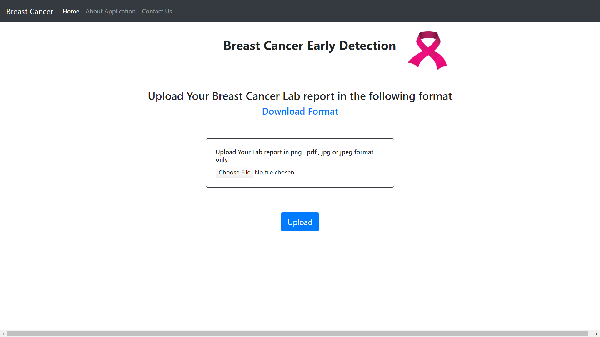

# Breast-Cancer-Early-Prediction

### This model is built to identify women suffering from breast cancer in its early period .

## Website Frontend


## Steps to be Followed 

* For the ease of the user instead of filling the fields of 25+ symptoms manually , we have implemented text detection in this model. 

* The user or the Hospital will have to download a template , which is the format in which data has to be reresented

* Fed this template into lab report generater (in case of Hospitals) or enter manually the values corresponding to each symptoms

## To Test Our Application

#### Download all the necessary modules in python 3.6 environmnet
```python 
pip install -r requirements.txt
```

#### To run application
```python 
python app.py
```
#### Follow above steps to test the application
